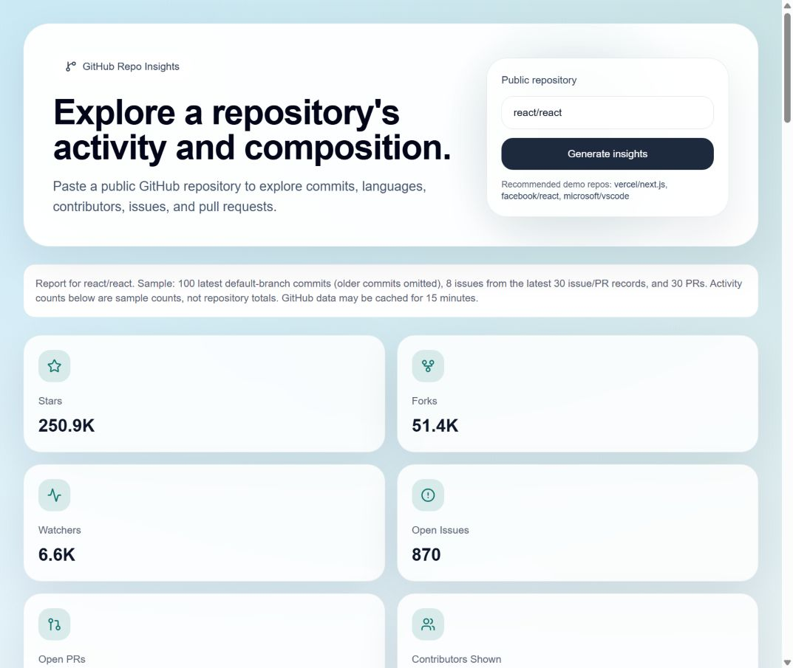

# GitHub Repo Insights

A dashboard for exploring public GitHub repository metadata, languages, contributors, and sampled development activity. Enter `owner/repo` or an HTTPS repository URL to generate a report without signing in.

The tool helps someone exploring a codebase see recent work alongside its language composition. It does not assess code quality or certify repository health.



Screenshot from the local production build. Counts change with GitHub activity; this is not a hosted demo.

## Current status

The app runs as a Next.js application with a server API. No hosted demo has been configured. Deployment requires a hosting account, repository import, and post-deployment checks. There is no database, OAuth flow, or paid API requirement.

## Features

- Stars, forks, watchers, open issues, open PRs, and repository metadata.
- Language percentages based on GitHub's reported byte counts.
- Twelve-week UTC commit chart with inactive weeks included.
- Up to five top contributors and twelve public events.
- Recently updated issues and PRs, sample merge times, and label frequencies.
- Explicit sample sizes, a documented activity score, and loading/error/empty states.

## Architecture and tradeoffs

```text
Repository input -> GET /api/insights -> GitHub REST API
                   validation + transformation -> dashboard charts and lists
```

`src/lib/github.ts` normalizes input, verifies public visibility, fetches metadata and seven detail endpoints, validates responses with Zod, and computes the report. `src/lib/schemas.ts` defines upstream contracts and the report contract. `src/app/api/insights/route.ts` maps typed failures to HTTP responses. The client dashboard validates the payload before rendering.

Next.js keeps the optional token on the server and avoids a separate backend service. Details are fetched concurrently after checking visibility. Each uncached report uses eight logical GitHub requests (moved repositories can add redirects). Next.js can cache successful upstream responses for 15 minutes; there is no persistent report store. Each request chain times out after 12 seconds; at most three redirects are followed, exclusively within the GitHub API origin.

The stack is Next.js 16, React 19, TypeScript 5, Tailwind CSS 4, Recharts 3, and Zod 4. Versions are pinned in `package.json` and the full dependency graph is recorded in `pnpm-lock.yaml`.

## Setup

Use Node.js **24.18.0 or later within 24.x** and **pnpm 10.34.6**. `.node-version` records the tested Node version.

```bash
git clone https://github.com/YangOwen007/github-repo-insights.git
cd github-repo-insights
npm install --global pnpm@10.34.6
pnpm install --frozen-lockfile
pnpm dev
```

Open [localhost:3000](http://localhost:3000). On Windows PowerShell, use `pnpm.cmd` if execution policy blocks the `pnpm.ps1` wrapper.

## Environment

No variable is required for local use. Optionally create `.env.local` using [.env.example](.env.example):

| Variable | Purpose |
| --- | --- |
| `GITHUB_TOKEN` | Optional server-only public read token for higher GitHub API quota. Never use a `NEXT_PUBLIC_` prefix. |

Use a dedicated fine-grained token with public repository read access; do not supply credentials with private organization access. Without a token, shared IP quota can exhaust quickly. A token raises quota but does not eliminate rate limiting. Configure it separately for preview and production; never commit it or print it in logs.

## Scripts and verification

```bash
pnpm lint
pnpm typecheck
pnpm test
pnpm build
pnpm scan:secrets
pnpm audit:security
```

Tests use Node's built-in runner and synthetic GitHub responses. They cover input boundaries, public-only enforcement, empty repositories, PR list contracts, pagination counts, calendar gaps, rate-limit/outage categories, and the per-process resource guard. They do not contact GitHub. The secret detector scans supported patterns in working files, reachable history, and build text assets, without displaying secret values. It cannot detect every password or private identifier.

CI uses a frozen install, lint, types, tests, production build, the built-in secret detector plus checksum-verified Gitleaks 8.30.1, audited dependencies, and production liveness smoke checks. Actions are pinned to commit hashes and receive read-only repository permissions. No GitHub token is needed by CI. See SECURITY.md for scanner exclusions for Next.js-generated server keys.

## Deployment

```bash
pnpm install --frozen-lockfile
pnpm build
pnpm start
```

This needs a Node runtime; a static export cannot serve `/api/insights`. See [DEPLOYMENT.md](DEPLOYMENT.md) for Vercel settings, generic Node hosting, verification, and rollback. `GET /api/health` returns liveness without contacting GitHub; it does not prove quota or network availability.

## Metric definitions and limitations

- **Commits:** latest 100 default-branch commits, bucketed by committer date. Thirty/90-day values are counts within that sample, not totals. Twelve calendar weeks include the current partial week; averages and streaks can undercount when older commits are omitted.
- **Contributors:** top five returned by GitHub, with all-time default-branch contributions. These are not active-contributor counts. GitHub may cache contributor statistics.
- **Issues/PRs:** latest 30 issue records (GitHub includes PRs, which are filtered out) and latest 30 PRs, ordered by update date. Counts refer to distinct sampled items, not update events. Sampling can omit most activity in busy repositories.
- **Open counts:** PR count uses the pagination header from `per_page=1`; issues subtract PRs from GitHub's combined open count. Concurrent activity may cause temporary disagreement between endpoints.
- **Merge time:** mean created-to-merged duration for sampled PRs merged within 30 days. Small and biased samples should not be used to compare maintainer performance.
- **Closure ratio:** sampled issues closed / opened within 30 days. It can exceed 1; zero intake means unknown. It is not the percentage of issues resolved.
- **Activity score:** non-archived repositories receive up to 60 commit points (3 per sampled commit within 90 days) plus 40 merge points (4 per sampled PR merge within 30 days). Archived repos receive zero. This arbitrary descriptive formula ignores stars/backlog size and says nothing about quality or security.
- **Availability:** GitHub quota, timeouts, unsupported upstream response changes, and endpoint failures can prevent a report. There is no partial-report fallback.
- **Abuse controls:** four concurrent reports and 30 attempts/minute per process. Multi-instance deployments need host-level limits; this is not a distributed rate limiter.

## Security, privacy, and dependencies

See [SECURITY.md](SECURITY.md) for token handling and reporting. The app has no analytics SDK or database and does not persist searches itself. Cached public GitHub responses and provider access logs still have privacy implications.

One known high-severity **development-only** advisory remains: [GHSA-vfj7-8cjw-p6xm](https://github.com/advisories/GHSA-vfj7-8cjw-p6xm) in `braces@3.0.3`, through the lint toolchain. The proposed `3.0.4` patch was unavailable in the registry at review time. The security audit reports this explicit exception and fails for other moderate-or-higher findings. Remove the exception when an installable patch is available. ESLint 9 is deprecated; upgrading its major version needs separate compatibility verification.

## Next steps

Priorities are a verified hosted preview, distributed quota protection if public usage grows, and fuller pagination or GitHub statistics endpoints with explicit completeness guarantees. Partial-report support and browser regression tests would improve resilience. Repository comparison and export are not implemented.

## License

No license has been selected. Public visibility is not an explicit license grant; choose a license before encouraging reuse or contributions.
